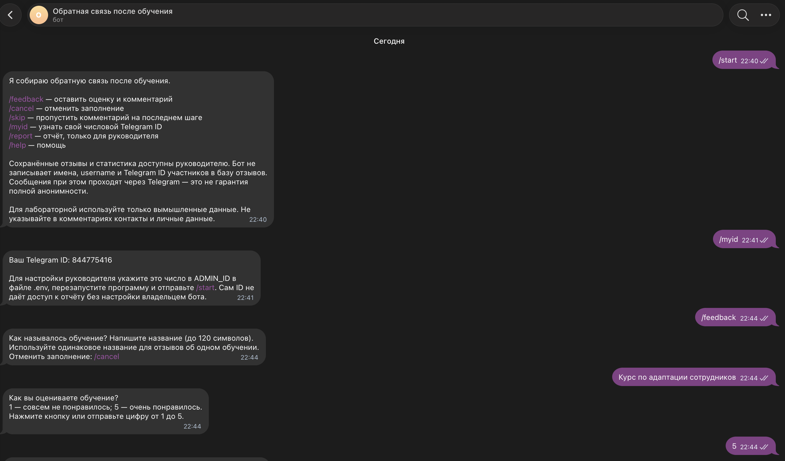
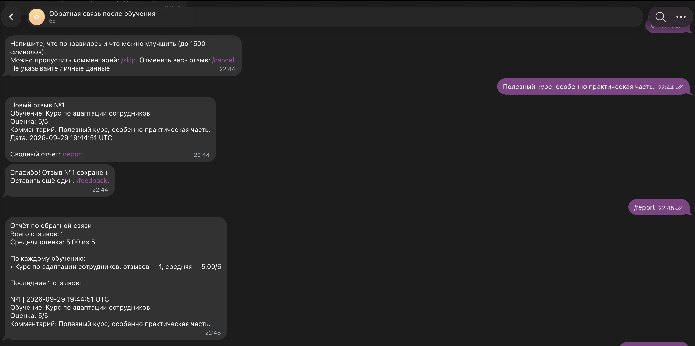
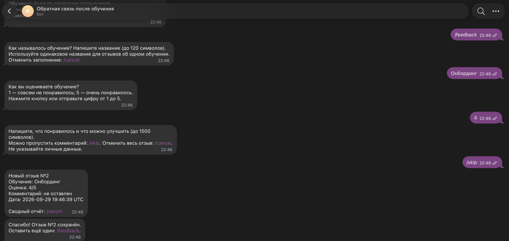
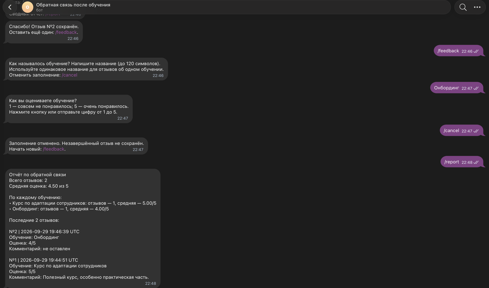

University: [ITMO University](https://itmo.ru/ru/) 
Faculty: [FICT](https://fict.itmo.ru) 
Course: Vibe Coding for Business 
Year: 2026/2027 
Group: ВвВТ УВБ 3.1 
Author: Лампадова Мария Витальевна 
Lab: Telegram Feedback Bot 
Date of create: 29.09.2026 
Date of finished:

# Лабораторная работа. Telegram-бот для сбора обратной связи

## 1. Описание задачи

В рамках лабораторной работы был создан Telegram-бот для сбора обратной связи после обучения сотрудников.

Бот решает задачу автоматизации сбора отзывов: участник обучения может указать название программы, поставить оценку от 1 до 5 и оставить комментарий. После отправки отзыв сохраняется в базе данных, а руководитель получает уведомление о новом отзыве.

Дополнительно руководитель может получить сводный отчет со статистикой по всем сохраненным отзывам.

## 2. Какую проблему решает бот

При ручном сборе обратной связи данные могут поступать в разных форматах и каналах, из-за чего их приходится отдельно собирать и обрабатывать.

Бот позволяет:

- собирать отзывы в едином формате;
- хранить оценки и комментарии в одном месте;
- автоматически уведомлять руководителя;
- получать общую статистику по отзывам;
- сохранять данные между перезапусками приложения.

## 3. Почему была выбрана эта задача

Задача сбора обратной связи близка к реальным бизнес-процессам, связанным с обучением сотрудников и оценкой эффективности внутренних программ.

Такой бот может использоваться после тренингов, адаптационных мероприятий, внутренних курсов или других форматов обучения, где важно быстро получить структурированную обратную связь.

## 4. Промпт для LLM

Для генерации кода был использован ChatGPT.

Исходный промпт был составлен по шаблону из задания и дополнен конкретным сценарием бота для сбора обратной связи после обучения.

### Исходный промпт

Создай Telegram-бота на Python с использованием библиотеки python-telegram-bot.

Задача:
Бот собирает обратную связь после обучения сотрудников.
Организатору нужно получать оценки и комментарии, видеть общую
статистику и узнавать о новых отзывах без ручного сбора сообщений.

Бот работает на русском языке в личных чатах.
Для лабораторной используются только вымышленные тестовые данные.

Функционал:

1. Команды /start и /help объясняют назначение бота и показывают
   доступные команды.

2. Команда /feedback запускает сбор отзыва:
   - бот спрашивает название обучения;
   - предлагает поставить оценку от 1 до 5 с помощью кнопок;
   - просит написать комментарий или пропустить его командой /skip;
   - сохраняет завершённый отзыв и благодарит пользователя.

3. Команда /cancel отменяет заполнение отзыва.
   Незавершённый отзыв не сохраняется.

4. Данные хранятся в SQLite и сохраняются после перезапуска бота:
   номер отзыва, название обучения, оценка, комментарий,
   дата и время отправки.
   Имена, username и Telegram ID участников в базу не записываются.

5. После сохранения отзыва бот отправляет руководителю уведомление:
   название обучения, оценку и комментарий.
   Если уведомление не удалось отправить, сохранённый отзыв
   не должен потеряться.

6. Команда /report доступна только руководителю и показывает:
   - общее количество отзывов;
   - среднюю оценку;
   - количество отзывов и среднюю оценку по каждому обучению;
   - последние 10 отзывов с оценками и комментариями.
   Если отзывов ещё нет, бот сообщает об этом понятным текстом.
   Обычные пользователи не могут просматривать чужие отзывы.

7. Команда /myid показывает пользователю его собственный
   числовой Telegram ID для настройки доступа руководителя.

Технические требования:
- Локальный запуск на macOS через polling, без отдельного сервера.
- BOT_TOKEN и ADMIN_ID загружаются из файла .env.
- Токен нельзя размещать в коде или выводить в логи.
- Проверять введённые данные и обрабатывать ошибки.
- Код должен быть понятным и содержать комментарии на русском языке.
- Указать необходимую версию Python и совместимые версии библиотек.

Создай следующие файлы:
1. bot.py — код бота.
2. requirements.txt — зависимости с зафиксированными версиями.
3. README.md — пошаговая инструкция по установке, настройке,
   запуску и тестированию всех функций.
4. .env.example — пример настроек без настоящего токена.
5. .gitignore — исключения для .env, базы данных,
   виртуального окружения и служебных файлов.

### Итерации и улучшения

В процессе работы промпт был уточнён по сравнению с базовым шаблоном из задания.

Были добавлены следующие требования:

- использование SQLite для хранения отзывов;
- сохранение данных после перезапуска;
- отдельный доступ руководителя к отчету;
- команда /myid для настройки ADMIN_ID;
- кнопки для выбора оценки;
- возможность пропустить комментарий через /skip;
- отмена незавершенного отзыва через /cancel;
- уведомление руководителю после сохранения нового отзыва;
- запрет на хранение Telegram ID, username и имени участника в базе;
- хранение токена только в переменной окружения;
- обработка ошибок и сохранение отзыва даже в случае ошибки отправки уведомления.

### Финальный промпт

Финальный промпт совпадает с приведенным выше вариантом и был сохранен в файле:

prompt.md

Именно по нему был сгенерирован основной код бота и структура проекта.

## 5. Стек технологий

Для реализации бота использовались:

- Python 3.9.6;
- python-telegram-bot 21.11.1;
- python-dotenv 1.1.1;
- SQLite;
- Telegram Bot API;
- ChatGPT для генерации и доработки кода.

### Почему были выбраны именно эти технологии

Python был выбран как один из самых простых и распространённых языков для создания Telegram-ботов.

Библиотека python-telegram-bot позволяет удобно работать с командами, сообщениями, кнопками и polling.

SQLite используется как простая локальная база данных, которая не требует отдельного сервера и подходит для учебного проекта.

python-dotenv позволяет хранить секретные данные, такие как токен бота и Telegram ID руководителя, отдельно от исходного кода.

## 6. Трудности и решения

### Совместимость версии Python

На компьютере была установлена версия Python 3.9.6. Поэтому для проекта была выбрана совместимая версия библиотеки python-telegram-bot — 21.11.1.

### Безопасное хранение токена

Токен Telegram-бота не размещался в файле bot.py.

Для него был создан отдельный файл .env, который добавлен в .gitignore.

В репозитории может храниться только файл .env.example без настоящих секретных данных.

### Настройка доступа руководителя

Для команды /report потребовалось определить Telegram ID пользователя, которому разрешён доступ к статистике.

Для этого была реализована команда /myid. Полученное значение было добавлено в ADMIN_ID в файле .env.

### Проверка сохранения данных

Для проверки работы SQLite бот был остановлен и запущен повторно.

После перезапуска ранее созданные тестовые отзывы сохранились и продолжили отображаться в отчёте /report.

### Проверка различных сценариев

Во время тестирования были отдельно проверены:

- обычный отзыв с комментарием;
- отзыв без комментария через /skip;
- отмена заполнения через /cancel;
- получение сводного отчёта через /report;
- сохранение данных после перезапуска бота;
- отправка уведомления руководителю о новом отзыве.

## 7. Выводы

В результате лабораторной работы был создан работающий Telegram-бот для сбора обратной связи после обучения сотрудников.

Бот умеет собирать название обучения, оценку и комментарий, сохранять данные в SQLite, отправлять уведомления руководителю и формировать сводный отчет по отзывам.

Код бота был сгенерирован с помощью LLM на основе заранее подготовленного промпта. В процессе работы требования были уточнены: добавлены безопасное хранение токена, разграничение доступа к отчету, сохранение данных между перезапусками и обработка дополнительных пользовательских сценариев.

Хорошо получилось реализовать полный основной сценарий работы бота и хранение данных без необходимости использовать отдельный сервер базы данных.

В дальнейшем бота можно улучшить, например:

- добавить более подробную аналитику;
- добавить выгрузку статистики в файл;
- настроить автоматические дайджесты;
- разместить бота на сервере для постоянной работы;
- добавить более гибкое управление доступом.

В ходе работы я познакомилась с созданием Telegram-ботов, использованием переменных окружения, SQLite и процессом генерации и доработки кода с помощью LLM.

## 8. Скриншоты работы бота

### Запуск бота и начало заполнения обратной связи

### Сохранение отзыва и сводный отчет

### Отзыв без комментария через /skip

### Отмена заполнения и итоговая статистика

## 9. Видео-демо

Видео-демо работы бота длительностью 2–3 минуты:

[Видео-демо работы бота](https://drive.google.com/file/d/1S7vSD3p-FjLjQOws2QFij2zea3JZOUS0/view?usp=sharing)
