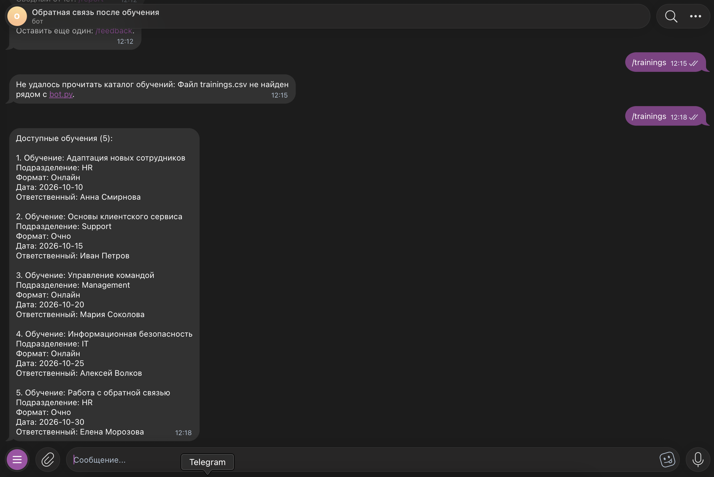
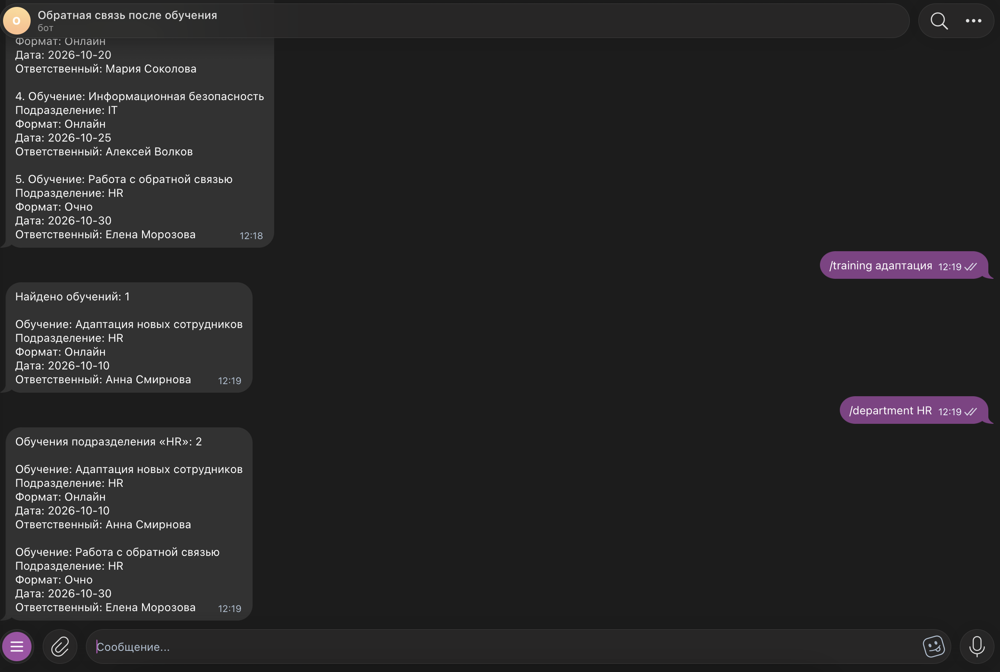
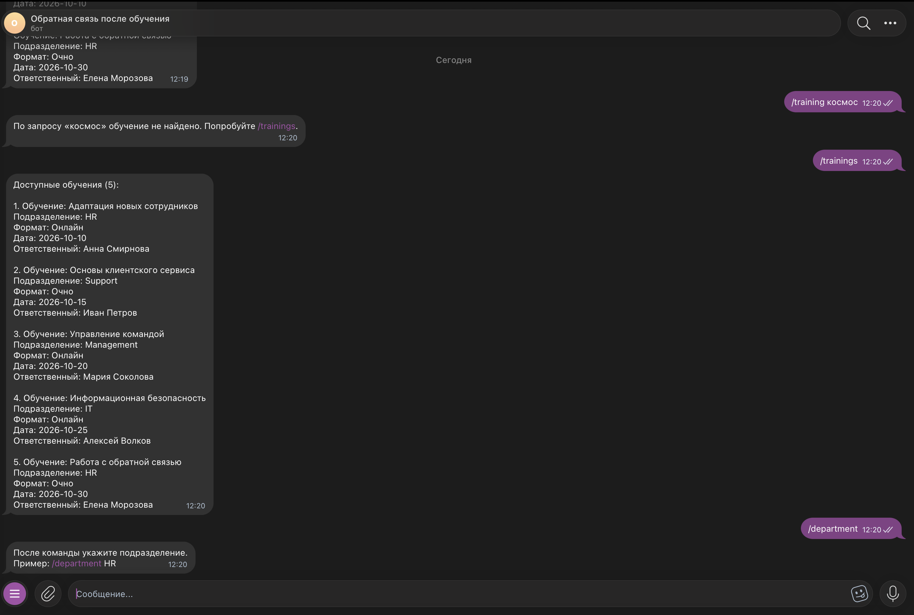
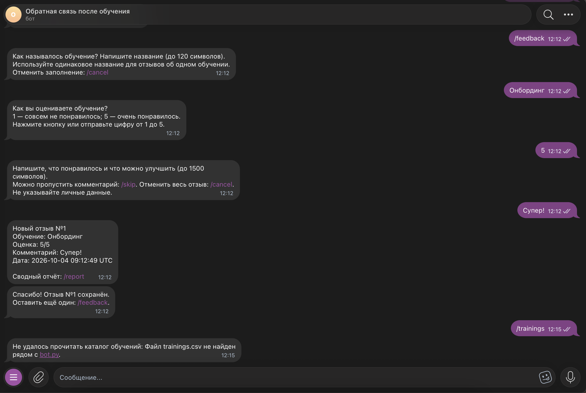

University: [ITMO University](https://itmo.ru/ru/) 
Faculty: [FICT](https://fict.itmo.ru) 
Course: Vibe Coding for Business 
Year: 2026/2027 
Group: ВвВТ УВБ 3.1 
Author: Лампадова Мария Витальевна 
Lab: Lab2 — Подключение бота к данным 
Date of create: 04.10.2026 
Date of finished:

# Лабораторная работа 2. Подключение бота к данным

## 1. Описание интеграции

В рамках лабораторной работы существующий Telegram-бот для сбора обратной связи был дополнен работой с внешним источником данных — CSV-файлом.

В качестве источника данных используется файл `trainings.csv`, содержащий каталог обучающих программ.

Бот читает данные из CSV и позволяет пользователю:

- посмотреть полный список обучений;
- найти обучение по части названия;
- отфильтровать обучения по подразделению;
- получить понятное сообщение, если данные не найдены;
- корректно обработать ситуацию, если CSV-файл недоступен.

При этом весь функционал первой лабораторной был сохранён: сбор отзывов, SQLite, уведомления руководителю и команда `/report`.

## 2. Почему был выбран CSV

CSV был выбран как простой и понятный формат для учебной интеграции.

Он не требует отдельного сервера, API-ключа или внешней базы данных, легко читается стандартными средствами Python и хорошо подходит для хранения небольшого каталога обучений.

Дополнительно такой формат удобно редактировать вручную и использовать как тестовый источник данных.

## 3. Структура данных

Файл `trainings.csv` имеет следующую структуру:

`name,department,format,date,owner`

Поля:

- `name` — название обучения;
- `department` — подразделение;
- `format` — формат обучения;
- `date` — дата проведения;
- `owner` — ответственный за обучение.

Пример данных:

- Адаптация новых сотрудников — HR — Онлайн — 2026-10-10 — Анна Смирнова
- Основы клиентского сервиса — Support — Очно — 2026-10-15 — Иван Петров
- Управление командой — Management — Онлайн — 2026-10-20 — Мария Соколова

## 4. Промпт для LLM

Для доработки бота был использован ChatGPT.

В LLM был передан промпт с описанием текущего функционала бота из первой лабораторной и требованиями к новой интеграции с CSV-файлом.

### Исходный промпт

Улучши моего существующего Telegram-бота на Python, добавив работу с CSV-файлом.

Текущий функционал бота:
- /start и /help показывают назначение и команды;
- /feedback запускает сбор обратной связи после обучения;
- пользователь указывает название обучения, оценку от 1 до 5 и комментарий;
- /skip позволяет пропустить комментарий;
- /cancel отменяет незавершённый отзыв;
- отзывы сохраняются в SQLite;
- после сохранения руководитель получает уведомление;
- /report доступен руководителю и показывает статистику по отзывам;
- /myid показывает Telegram ID для настройки ADMIN_ID.

Новый источник данных:
CSV-файл trainings.csv.

Структура файла:
name,department,format,date,owner

Новый функционал:
- команда /trainings для просмотра всех обучений;
- команда /training <запрос> для поиска по названию;
- команда /department <название отдела> для фильтрации;
- обработка отсутствующих аргументов;
- обработка ситуации, когда ничего не найдено;
- обработка ошибок чтения CSV;
- сохранение всего существующего функционала Lab1.

Технические требования:
- использовать стандартный модуль csv;
- не использовать pandas;
- сохранить работу SQLite;
- сохранить BOT_TOKEN и ADMIN_ID в .env;
- добавить новые команды в /start и /help;
- код должен быть понятным и содержать комментарии.

## 5. Итерации и улучшения

По сравнению с первой лабораторной бот был расширен без изменения основной логики сбора отзывов.

В промпт были добавлены отдельные требования к обработке ошибок:

- отсутствие файла trainings.csv;
- пустой CSV;
- отсутствие обязательных столбцов;
- некорректные строки;
- команды без аргументов;
- поиск, который не дал результатов.

Также было отдельно указано, что существующий функционал Lab1 нельзя удалять.

## 6. Финальный промпт

Финальный промпт был сохранён в файле:

`lab2/prompt.md`

Именно по нему LLM сгенерировала обновлённый `bot.py` и `README.md`.

## 7. Реализация

Для работы с CSV используется стандартный модуль Python `csv`.

Бот при каждом обращении к каталогу читает файл `trainings.csv`, проверяет его структуру и преобразует строки в данные, которые затем используются командами Telegram-бота.

### Команда /trainings

Показывает все доступные обучения из CSV-файла.

Для каждого обучения выводятся:

- название;
- подразделение;
- формат;
- дата;
- ответственный.

### Команда /training <запрос>

Ищет обучение по названию без учёта регистра.

Поддерживается частичное совпадение, поэтому запрос:

`/training адаптация`

находит обучение «Адаптация новых сотрудников».

### Команда /department <отдел>

Фильтрует обучения по значению поля department.

Например:

`/department HR`

выводит все обучения подразделения HR.

### Ключевые фрагменты кода

Для чтения и проверки CSV используется стандартный модуль `csv`.

Файл открывается через `TRAININGS_PATH.open(...)`, после чего данные считываются с помощью `csv.DictReader`.

Затем бот проверяет, что в CSV присутствуют обязательные столбцы из списка `REQUIRED_TRAINING_COLUMNS`.

Для поиска обучения используется сравнение без учёта регистра:

`query.casefold()`

Поиск выполняется по условию:

`query_folded in item["name"].casefold()`

Благодаря этому запрос `/training адаптация` может найти обучение «Адаптация новых сотрудников».

Для фильтрации по подразделению также применяется `casefold()`:

`item["department"].casefold() == department.casefold()`

Ошибки чтения CSV обрабатываются через `try/except`.

При возникновении `TrainingDataError` бот отправляет пользователю понятное сообщение об ошибке и продолжает работу вместо завершения программы.

### Обработка ошибок

Если пользователь не передал аргумент после команды, бот показывает пример правильного использования.

Если данные не найдены, бот сообщает об этом без завершения работы.

Если файл `trainings.csv` отсутствует, бот выводит понятное сообщение об ошибке и продолжает работать.

## 8. Используемые библиотеки

В проекте используются:

- `python-telegram-bot` — работа с Telegram Bot API;
- `python-dotenv` — загрузка BOT_TOKEN и ADMIN_ID из .env;
- `sqlite3` — хранение отзывов из Lab1;
- `csv` — чтение внешнего CSV-файла.

Новых внешних библиотек для CSV не потребовалось, так как модуль `csv` входит в стандартную библиотеку Python.

## 9. Тестирование

После запуска бота были проверены основные сценарии работы с CSV-файлом.

### Просмотр всех обучений

Команда:

`/trainings`

успешно выводит полный список обучений из файла `trainings.csv`.

### Поиск по названию

Команда:

`/training адаптация`

успешно находит обучение «Адаптация новых сотрудников».

Поиск работает без учёта регистра и поддерживает частичное совпадение.

### Фильтрация по подразделению

Команда:

`/department HR`

выводит все обучения, относящиеся к подразделению HR.

### Поиск отсутствующих данных

Команда:

`/training космос`

не вызывает ошибку. Бот сообщает, что подходящие обучения не найдены.

### Проверка команд без аргументов

Были протестированы команды:

`/training`

и

`/department`

В обоих случаях бот выводит пример правильного использования команды.

### Проверка отсутствующего CSV-файла

Для тестирования обработки ошибок файл `trainings.csv` был временно переименован.

После команды `/trainings` бот не завершил работу и вывел сообщение:

«Не удалось прочитать каталог обучений: Файл trainings.csv не найден рядом с bot.py.»

После теста файл был возвращён обратно.

### Примеры запросов и ответов

**Запрос:**

`/trainings`

**Ответ:**

Бот выводит полный список обучений из файла `trainings.csv` с названием, подразделением, форматом, датой и ответственным.

---

**Запрос:**

`/training адаптация`

**Ответ:**

Найдено обучение «Адаптация новых сотрудников» с полной информацией из CSV-файла.

---

**Запрос:**

`/department HR`

**Ответ:**

Бот выводит все обучения подразделения HR.

---

**Запрос:**

`/training космос`

**Ответ:**

Бот сообщает, что подходящие обучения не найдены.

---

**Запрос:**

`/training`

**Ответ:**

Бот показывает пример правильного использования команды:

`/training адаптация`

### Проверка старого функционала

Также была протестирована команда `/feedback`.

Сценарий сбора обратной связи из первой лабораторной продолжил работать после добавления CSV-интеграции.

## 10. Трудности и решения

### Сохранение функционала первой лабораторной

Основной задачей было добавить новый источник данных, не сломав уже существующие функции бота.

В промпте для LLM было отдельно указано, что команды обратной связи, SQLite и отчёт руководителя должны сохраниться.

После обновления кода старый сценарий `/feedback` был протестирован повторно.

### Работа с отсутствующим файлом

При обычном чтении CSV отсутствие файла могло бы привести к ошибке программы.

Поэтому была добавлена обработка исключения: бот сообщает пользователю о проблеме, но продолжает работу.

### Проверка пользовательского ввода

Пользователь может вызвать `/training` или `/department` без дополнительного текста.

Для таких случаев добавлены понятные подсказки с примерами правильного использования.

## 11. Выводы

В результате лабораторной работы существующий Telegram-бот был успешно подключён к внешнему источнику данных в формате CSV.

Бот научился:

- читать данные из `trainings.csv`;
- показывать полный каталог обучений;
- искать обучение по части названия;
- фильтровать данные по подразделению;
- корректно обрабатывать отсутствие результатов;
- корректно обрабатывать ошибки чтения файла.

При этом функционал первой лабораторной был сохранён.

Хорошо получилось реализовать интеграцию без дополнительных внешних библиотек и сохранить простую структуру проекта.

В дальнейшем можно улучшить бота, например:

- добавить фильтрацию по дате и формату;
- добавить сортировку обучений;
- добавить возможность редактировать каталог через Telegram;
- подключить Excel, API или полноценную внешнюю базу данных;
- добавить кэширование данных.

## 12. Скриншоты работы с данными

### Просмотр полного каталога обучений

### Поиск обучения и фильтрация по подразделению

### Обработка некорректного пользовательского ввода

### Обработка отсутствующего CSV-файла

## 13. Видео-демо

Видео-демо работы бота с CSV-интеграцией длительностью 2–3 минуты:

[Видео-демо работы бота с CSV-интеграцией](https://drive.google.com/file/d/1cnDH5DJCLU5tCuhnDNqPcgZx42kF865r/view?usp=sharing)
