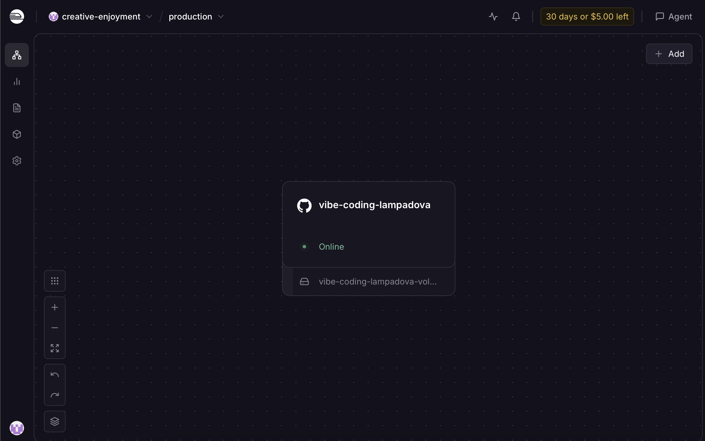
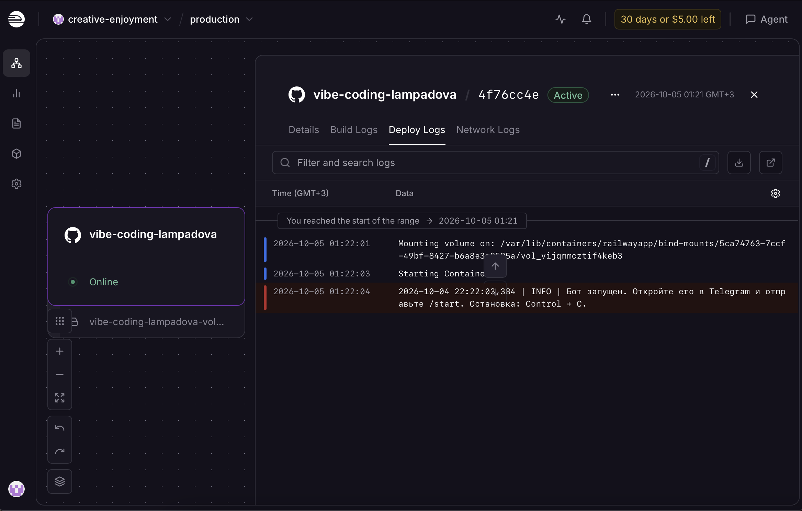
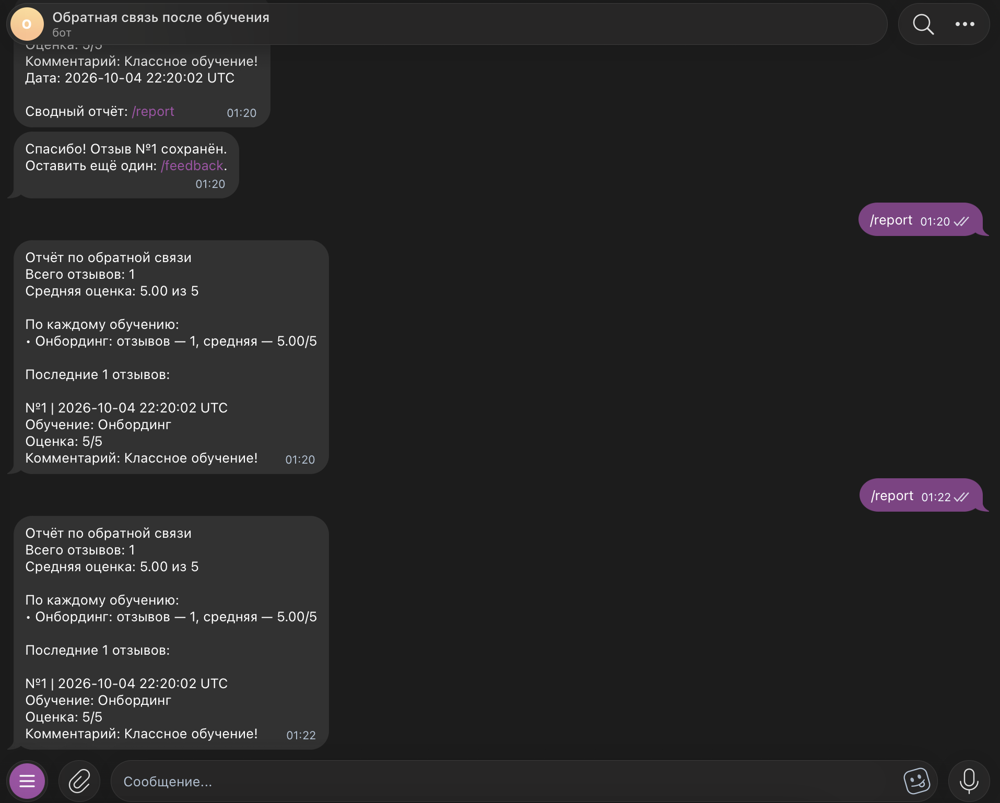
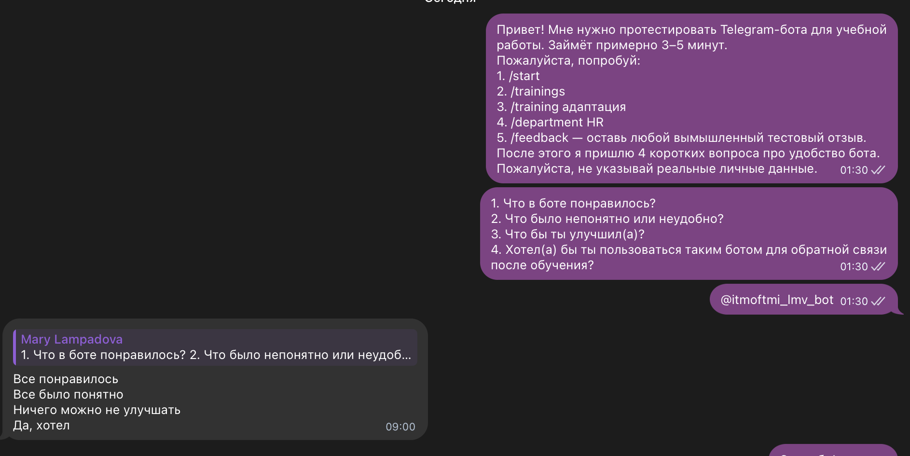
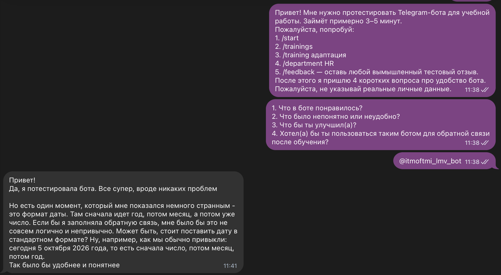
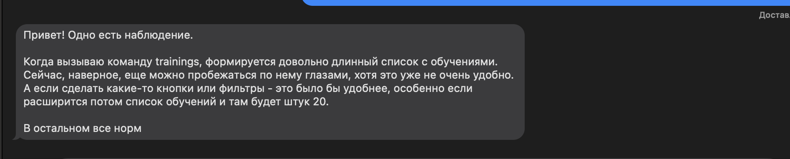
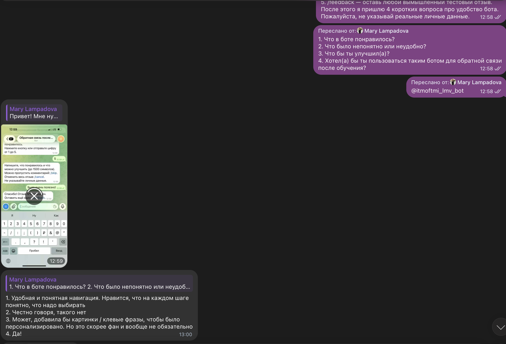
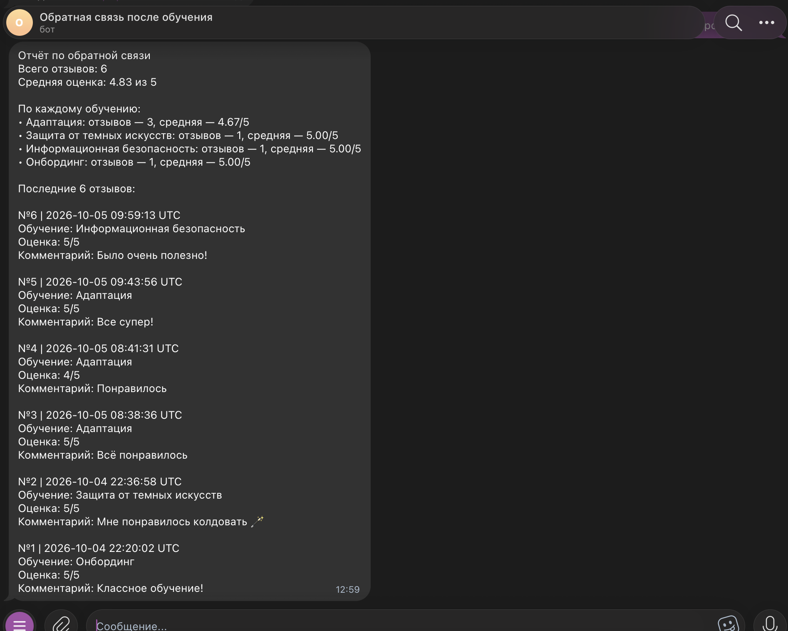
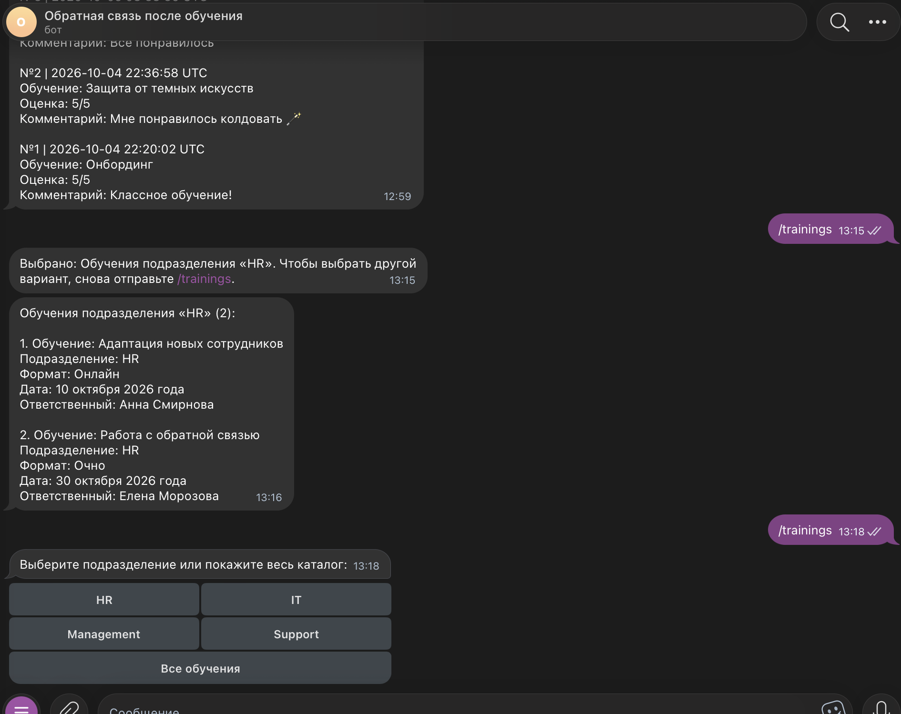
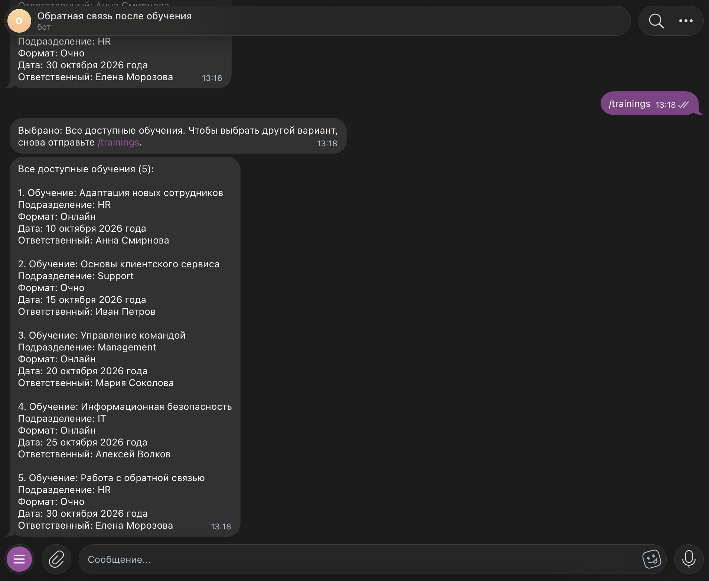

University: [ITMO University](https://itmo.ru/ru/) 
Faculty: [FICT](https://fict.itmo.ru) 
Course: Vibe Coding for Business 
Year: 2026/2027 
Group: ВвВТ УВБ 3.1 
Author: Лампадова Мария Витальевна 
Lab: Lab3 — Запуск бота для реального использования 
Date of create: 05.10.2026 
Date of finished:

# Лабораторная работа 3. Запуск бота для реального использования

## 1. Описание деплоя

В рамках лабораторной работы Telegram-бот, созданный в предыдущих лабораторных работах, был развернут в облаке для постоянного использования.

Для деплоя была выбрана платформа Railway.

Бот продолжает работать через polling: приложение постоянно запущено в Railway и самостоятельно получает новые сообщения от Telegram. Отдельный webhook и публичный web-сервер для текущей реализации не используются.

После деплоя бот доступен пользователям в Telegram:

`@itmoftmi_lmv_bot`

## 2. Почему был выбран Railway

Railway был выбран как относительно простой способ облачного развертывания Python-приложения.

Основные причины выбора:

- возможность подключить существующий GitHub-репозиторий;
- автоматическая сборка Python-проекта;
- поддержка переменных окружения;
- возможность указать отдельную папку проекта в monorepo;
- возможность подключить постоянное хранилище;
- отсутствие необходимости постоянно держать включенным локальный компьютер.

Проект хранится в общем GitHub-репозитории `vibe-coding-lampadova`, а для Railway в качестве Root Directory используется:

`/lab3`

## 3. Настройка Railway

Для запуска бота были настроены переменные окружения:

- `BOT_TOKEN` — токен Telegram-бота;
- `ADMIN_ID` — Telegram ID руководителя;
- `DATA_DIR=/data` — путь для постоянного хранения SQLite-базы.

Настоящие значения `BOT_TOKEN` и `ADMIN_ID` не хранятся в GitHub.

Для запуска приложения в Railway используется команда:

`python bot.py`

Также к сервису был подключен Railway Volume с путем:

`/data`

SQLite-база `feedback.db` сохраняется внутри этого постоянного хранилища.

Это позволяет сохранять отзывы пользователей даже после перезапуска или повторного деплоя приложения.

## 4. Результат деплоя

После настройки Railway сервис успешно запустился и получил статус Online.

В логах Railway отображается запуск контейнера и сообщение о запуске Telegram-бота.

Работа бота была дополнительно проверена при выключенной локальной версии на компьютере. Команды `/start`, `/trainings`, `/feedback` и `/report` продолжили работать, что подтвердило выполнение бота непосредственно в Railway.

Также был выполнен повторный deploy. После перезапуска ранее сохраненные отзывы остались в базе данных, что подтвердило корректную работу постоянного Railway Volume.

## 5. Сбор обратной связи

После успешного деплоя бот был передан нескольким реальным пользователям для тестирования.

Пользователям было предложено проверить:

- `/start`;
- `/trainings`;
- `/training адаптация`;
- `/department HR`;
- `/feedback`.

После тестирования пользователям были заданы вопросы:

1. Что в боте понравилось?
2. Что было непонятно или неудобно?
3. Что можно улучшить?
4. Хотели бы они пользоваться таким ботом для обратной связи после обучения?

Всего было собрано 4 пользовательских отзыва.

## 6. Статистика использования

Во время пользовательского тестирования бот продолжал работать в Railway.

По данным команды `/report` в базе было сохранено 6 отзывов.

Средняя оценка составила:

`4.83 из 5`

Отзывы были оставлены по нескольким обучающим программам, включая:

- Адаптацию;
- Информационную безопасность;
- Онбординг;
- Защиту от темных искусств.

Это показало, что бот продолжал корректно сохранять данные от нескольких пользователей и формировать общую статистику.

## 7. Анализ обратной связи

В целом пользователи положительно оценили работу бота.

Среди положительных комментариев были отмечены:

- понятная логика работы;
- простая навигация;
- понятные шаги при заполнении обратной связи;
- корректная работа основных команд.

При этом были выявлены две основные точки улучшения.

### Формат даты

Один из пользователей отметил, что дата в формате:

`2026-10-10`

выглядит технически и непривычно.

Было предложено использовать более понятный формат:

`10 октября 2026 года`

### Длинный список обучений

Другой пользователь отметил, что команда `/trainings` формирует длинный текстовый список.

При небольшом количестве данных это допустимо, однако при росте каталога до 20 и более обучений такой формат станет неудобным.

В качестве улучшения пользователь предложил добавить кнопки или фильтрацию.

## 8. Приоритеты улучшений

По результатам анализа было принято решение реализовать обе найденные точки улучшения:

1. сделать даты более понятными для пользователя;
2. изменить команду `/trainings`, добавив выбор подразделения через inline-кнопки.

Эти изменения были выбраны, потому что они напрямую влияют на удобство использования и остаются актуальными при дальнейшем расширении каталога обучений.

## 9. Улучшения на основе обратной связи

Для доработки бота был составлен отдельный промпт для LLM на основе пользовательской обратной связи.

Промпт был сохранен в файле:

`lab3/improvement_prompt.md`

В промпте были описаны две основные проблемы:

- неудобный технический формат даты;
- слишком длинный список обучений в `/trainings`.

LLM была поставлена задача сохранить существующий функционал и добавить улучшения без изменения текущего способа деплоя в Railway.

## 10. Что было изменено

### Человекочитаемый формат даты

Для дат из `trainings.csv` был добавлен отдельный форматтер.

Теперь дата вида:

`2026-10-10`

отображается как:

`10 октября 2026 года`

Если дата в CSV имеет некорректный формат, бот не завершается с ошибкой и может показать исходное значение.

### Inline-кнопки для `/trainings`

Команда `/trainings` была изменена.

Теперь вместо немедленного вывода длинного списка бот сначала предлагает выбрать подразделение с помощью inline-кнопок.

Подразделения автоматически берутся из файла `trainings.csv`.

Также добавлена кнопка:

`Все обучения`

После выбора подразделения бот показывает только подходящие обучения.

Существующая команда `/department <отдел>` при этом была сохранена.

## 11. Проверка улучшений

После генерации обновленного кода была выполнена проверка синтаксиса Python.

Затем изменения были отправлены в GitHub, после чего Railway автоматически развернул новую версию.

После нового деплоя было проверено:

- `/trainings` показывает inline-кнопки подразделений;
- кнопка «Все обучения» выводит полный каталог;
- выбор подразделения выводит только соответствующие обучения;
- даты отображаются в человекочитаемом русском формате;
- существующие команды бота продолжают работать;
- сохраненные отзывы в SQLite не были потеряны.

Обе доработки, основанные на пользовательской обратной связи, были успешно реализованы.

## 12. Результат после улучшения

После обновления бот стал удобнее для просмотра каталога обучений.

Пользователю больше не нужно сразу просматривать длинный список: сначала можно выбрать нужное подразделение.

Формат дат также стал более привычным и понятным для русскоязычного пользователя.

При этом архитектура проекта и текущий облачный деплой в Railway были сохранены.

## 13. Скриншоты

### Railway: сервис работает в облаке

### Railway: логи успешного запуска

### Проверка сохранения данных после redeploy

### Отзыв пользователя 1

### Отзыв пользователя 2

### Отзыв пользователя 3

### Отзыв пользователя 4

### Статистика использования

### Улучшение: кнопки подразделений

### Улучшение: новый формат даты

## 14. Выводы

В рамках лабораторной работы Telegram-бот был развернут в облаке на Railway и стал доступен для реального использования без необходимости держать включенным локальный компьютер.

Были настроены:

- деплой из GitHub;
- переменные окружения;
- постоянное хранилище Railway Volume;
- сохранение SQLite-базы после redeploy;
- логирование и проверка стабильности работы.

Бот был протестирован реальными пользователями, после чего была собрана обратная связь.

На основе пользовательских отзывов были выявлены две основные точки улучшения:

- неудобный технический формат даты;
- слишком длинный список обучений.

С помощью LLM были реализованы улучшения:

- человекочитаемый формат даты;
- inline-кнопки для фильтрации каталога обучений.

После повторного деплоя обе доработки были успешно протестированы.

В результате получилось пройти полный путь от локального прототипа до работающего облачного продукта: разработка, интеграция с данными, деплой, сбор пользовательской обратной связи и улучшение продукта на основе реального использования.

В дальнейшем бота можно развивать дальше, например:

- добавить больше вариантов фильтрации;
- реализовать редактирование каталога обучений;
- добавить экспорт статистики;
- улучшить аналитику по отзывам;
- добавить роли и более гибкое управление доступом.
